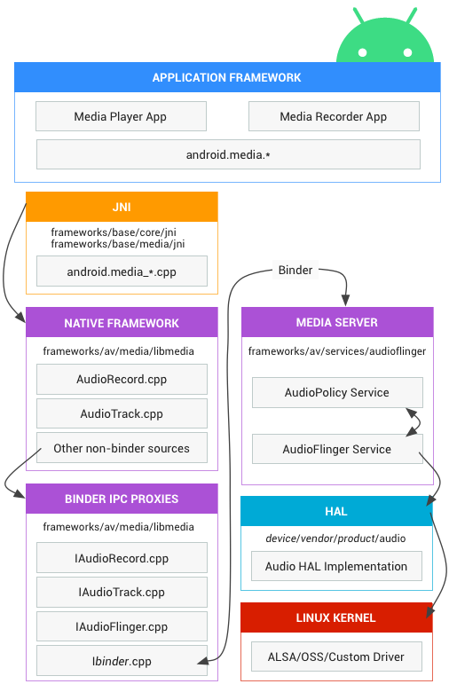

# Android Audio 框架

## 本篇文章目标

- 了解 Android Audio 系统架构
- 了解 Android Audio 代码的目录结构
- 了解 Android Audio 的基本概念
- 了解 Android Audio 的设计理念

## Android Audio 框架图



## Android Audio 代码目录结构

### 代码路径
```
# java 层测试代码
frameworks/base/media/tests/AudioPolicyTest/
frameworks/base/media/tests/ScoAudioTest/
frameworks/base/media/tests/SoundPoolTest/
frameworks/base/media/tests/audiotests/

# java 层代码
Android12/frameworks/base/media/java/android/media
Android12/frameworks/base/services/core/java/com/android/server/audio

# jni 层代码
Android12/frameworks/base/core/jni
frameworks/base/media/jni/audioeffect/
frameworks/base/media/jni/soundpool/

# system 层代码
Android12/system/media/audio/
Android12/system/media/audio_effects/
Android12/system/media/audio_route/
Android12/system/media/audio_utils/
Android12/system/media/alsa_utils/

# native 层 media 的代码
Android12/frameworks/av/media/libaudioclient
Android12/frameworks/av/media/libaaudio
Android12/frameworks/av/media/libaudioprocessing
Android12/frameworks/av/media/libaudiohal
Android12/frameworks/av/media/libaudiofoundation
Android12/frameworks/av/media/audioserver

# native 层 service 的代码
Android12/frameworks/av/services/audiopolicy
Android12/frameworks/av/services/audioflinger

# hardware 层的代码
Android12/hardware/interfaces/audio/
Android12/hardware/interfaces/soundtrigger/
Android12/hardware/libhardware/modules/audio/
Android12/hardware/libhardware/modules/audio_remote_submix/
Android12/hardware/libhardware/modules/usbaudio/

# audio hal 层的代码
Android12/hardware/xxx/audio/

# 芯片厂商等的代码
Android12/vendor/mediatek/tv/hardware/audio
Android12/vendor/mediatek/tv/misdk
Android12/vendor/tcl/proprietary/frameworks
Android12/vendor/tcl/hardware/audio

# 扩展代码
Android12/external/tinyalsa_new
```

## Android Audio 的基本概念

AudioService
AudioTrack
AudioRecord
AudioServe
AudioPolicy
AudioFlinger
AudioHal
TinyAlsa

AudioAttribute
stream type

module
output
profile
device
audio port
flags
session
strategy
audio config
audio gain
audio profile
audio patch
audio format
channel mask
audio source

## Android Audio 的设计理念

