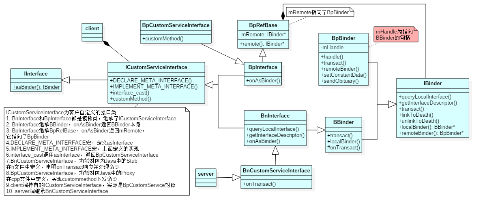

# Binder

## 本篇文章目标

- 理解 binder
- 熟悉 binder 在 Android 的使用
- 了解 binder 的通信过程

## binder 是什么

Binder 是 Android 系统**进程间通信**​（IPC）方式之一，它是基于开源的 OpenBinder 实现的  
Android 系统的许多服务都是基于 Binder，所以理解 Binder 对于理解服务的流程有很大的帮助

> 关键点：进程间通信

## 实现binder的理由

### 1. 通信方式

Android 系统有各种复杂的服务，为了应对各种复杂的服务之间的通信，需要实现一种基于**Client-Server**的通信方式。而现有的消息队列/共享内存/信号量/socket 等IPC都不符合要求。

> 关键点：Client-Server

### 2. 传输性能

各种IPC方式数据拷贝次数

|         IPC         | 数据拷贝次数 |
| :-----------------: | :---------: |
|       共享内存       |      0      |
|        Binder       |      1      |
| Socket/管道/消息队列 |      2      |

> 关键点：只拷贝1次

### 3. 安全性考虑

Android作为一个开放式，拥有众多开发者的的平台，应用程序的来源广泛，确保智能终端的安全是非常重要的。  
终端用户不希望从网上下载的程序在不知情的情况下偷窥隐私数据，连接无线网络，长期操作底层设备导致电池很快耗尽等等。  
传统IPC没有任何安全措施，完全依赖上层协议来确保。  
首先传统IPC的接收方无法获得对方进程可靠的UID/PID（用户ID/进程ID），从而无法鉴别对方身份。

Android为每个安装好的应用程序分配了自己的UID，故进程的UID是鉴别进程身份的重要标志。使用传统IPC只能由用户在数据包里填入UID/PID，但这样不可靠，容易被恶意程序利用。可靠的身份标记只有由IPC机制本身在内核中添加。

其次传统IPC访问接入点是开放的，无法建立私有通道。  
比如命名管道的名称，system V的键值，socket的ip地址或文件名都是开放的，只要知道这些接入点的程序都可以和对端建立连接，不管怎样都无法阻止恶意程序通过猜测接收方地址获得连接。

> 关键点: 利用 UID 实现安全性

## Binder 面向对象的设计思想

Binder使用Client-Server通信方式：  
一个进程作为Server提供诸如视频/音频解码，视频捕获，地址本查询，网络连接等服务；多个进程作为Client向Server发起服务请求，获得所需要的服务。  

要想实现Client-Server通信据必须实现以下两点：  
一是server必须有确定的访问接入点或者说地址来接受Client的请求，并且Client可以通过某种途径获知Server的地址；  
二是制定Command-Reply协议来传输数据。例如在网络通信中Server的访问接入点就是Server主机的IP地址+端口号，传输协议为TCP协议。对Binder而言，Binder可以看成Server提供的实现某个特定服务的访问接入点， Client通过这个‘地址’向Server发送请求来使用该服务；对Client而言，Binder可以看成是通向Server的管道入口，要想和某个Server通信首先必须建立这个管道并获得管道入口。

与其它IPC不同，Binder使用了面向对象的思想来描述作为访问接入点的Binder及其在Client中的入口：Binder是一个实体位于Server中的对象，该对象提供了一套方法用以实现对服务的请求，就象类的成员函数。  

遍布于client中的入口可以看成指向这个binder对象的‘指针’，一旦获得了这个‘指针’就可以调用该对象的方法访问server。在Client看来，通过Binder‘指针’调用其提供的方法和通过指针调用其它任何本地对象的方法并无区别，尽管前者的实体位于远端Server中，而后者实体位于本地内存中。‘指针’是C++的术语，而更通常的说法是引用，即Client通过Binder的引用访问Server。而软件领域另一个术语‘句柄’也可以用来表述Binder在Client中的存在方式。从通信的角度看，Client中的Binder也可以看作是Server Binder的‘代理’，在本地代表远端Server为Client提供服务。本文中会使用‘引用’或‘句柄’这个两广泛使用的术语。

面向对象思想的引入将进程间通信转化为通过对某个Binder对象的引用调用该对象的方法，而其独特之处在于Binder对象是一个可以跨进程引用的对象，它的实体位于一个进程中，而它的引用却遍布于系统的各个进程之中。  

最诱人的是，这个引用和java里引用一样既可以是强类型，也可以是弱类型，而且可以从一个进程传给其它进程，让大家都能访问同一Server，就象将一个对象或引用赋值给另一个引用一样。Binder模糊了进程边界，淡化了进程间通信过程，整个系统仿佛运行于同一个面向对象的程序之中。形形色色的Binder对象以及星罗棋布的引用仿佛粘接各个应用程序的胶水，这也是Binder在英文里的原意。

当然面向对象只是针对应用程序而言，对于Binder驱动和内核其它模块一样使用C语言实现，没有类和对象的概念。Binder驱动为面向对象的进程间通信提供底层支持。

> 关键点：通过面向对象，把进程间通信转化成本地调用

## Binder 架构

Binder框架定义了四个角色：Server，Client，ServiceManager 以及 Binder 驱动。  
其中 Server，Client，ServiceManager运行于用户空间，Binder 驱动运行于内核空间。

> 关键点：Server，Client，ServiceManager，Binder驱动

## 匿名 Binder

并不是所有Binder都需要注册给SMgr广而告之的。  
Server端可以通过已经建立的Binder连接将创建的Binder实体传给Client，  
当然这条已经建立的Binder连接必须是通过实名Binder实现。  

由于这个Binder没有向SMgr注册名字，所以是个匿名Binder。  
Client将会收到这个匿名Binder的引用，通过这个引用向位于Server中的实体发送请求。  
匿名Binder为通信双方建立一条私密通道，只要Server没有把匿名Binder发给别的进程，别的进程就无法通过穷举或猜测等任何方式获得该Binder的引用，向该Binder发送请求

> 关键点：没有向 ServiceManager 注册名字

## Binder CPP 类图

- BpBinder: Binder proxy，表示代理，是客户端持有的一个代理对象  
  transact：客户端持有后，BpBinder.transact() 用于发送命令。
- BnBinder: Binder native，表示本地对象。与 BBinder 是同一个东西  
  onTransact：本地服务端，BBinder.onTransact() 用于响应命令并处理。
- BpRefBase
  mRemote 指针指向 IBinder，具体是 BpBinder 对象。

## 参考资料

1. <https://redspider110.github.io/2017/12/21/0041-android-binder/>  
2. <http://gityuan.com/2015/10/31/binder-prepare/>  

