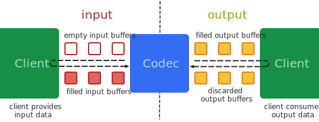

# MediaCodec

## 本篇文章目标

- 了解 MediaCodec
- 掌握 MediaCodec API

## MediaCodec 基本介绍
MediaCodec 类可用于访问低级媒体编解码器，即编码器/解码器组件。  
MediaCodec 是 Android 提供的用于对音视频进行编解码的类，它通过访问底层的 codec 来实现编解码的功能  
它是 Android 低级多媒体支持基础结构的一部分  
它为芯片厂商和应用开发者搭建了一个统一接口  

## MediaCodec 在 Android 中的位置


## MediaCodec 数据处理流程设计



从上图可以看出 MediaCodec 架构上采用了2个缓冲区队列，异步处理数据，并且使用了一组输入输出缓存。  

Client 请求或接收到一个空的输入缓存（input buffer），向其中填充满数据并将它传递给编解码器处理。  
编解码器处理完这些数据并将处理结果输出至一个空的输出缓存（output buffer）中。  
最终，Client 请求或接收到一个填充了结果数据的输出缓存（output buffer），使用完其中的数据，并将其释放给编解码器再次使用。  

具体工作如下：  

1. Client 从 input 缓冲区队列申请 empty buffer [dequeueInputBuffer]
2. Client 把需要编解码的数据拷贝到 empty buffer，然后放入 input 缓冲区队列 [queueInputBuffer]
3. MediaCodec 模块从 input 缓冲区队列取一帧数据进行编解码处理
4. 编解码处理结束后，MediaCodec 将原始数据 buffer 置为 empty 后放回 input 缓冲区队列，将编解码后的数据放入到 output 缓冲区队列
5. Client 从 output 缓冲区队列申请编解码后的 buffer [dequeueOutputBuffer]
6. Client 对编解码后的 buffer 进行渲染/播放
7. 渲染/播放完成后，Client 再将该 buffer 放回 output 缓冲区队列 [releaseOutputBuffer]

## MediaCodec API 介绍

## MediaCodec 的基本调用流程

```
createEncoderByType/createDecoderByType
configure
start
while(true) {
     dequeueInputBuffer  //从输入流队列中取数据进行编码操作 
     getInputBuffers     //获取需要编码数据的输入流队列，返回的是一个ByteBuffer数组 
     queueInputBuffer    //输入流入队列 

     dequeueOutputBuffer //从输出队列中取出编码操作之后的数据
     getOutPutBuffers    // 获取编解码之后的数据输出流队列，返回的是一个ByteBuffer数组
     releaseOutputBuffer //处理完成，释放ByteBuffer数据
}
stop
release
```

## MediaCodec 的生命周期

## MediaCodec 的配置文件

## 参考资料
1. <https://developer.android.com/reference/android/media/MediaCodec>