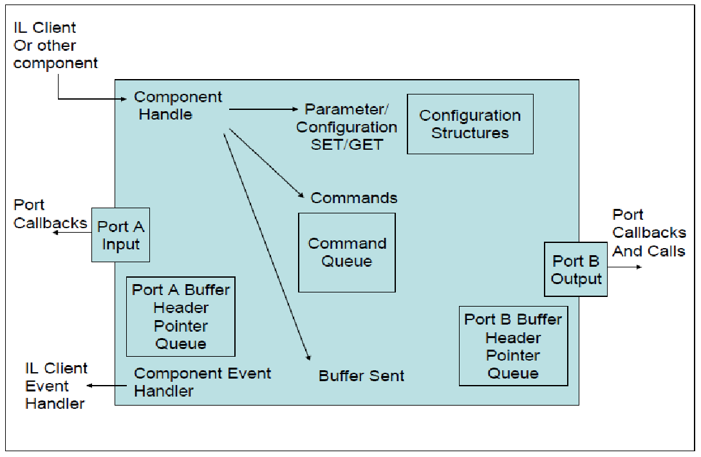
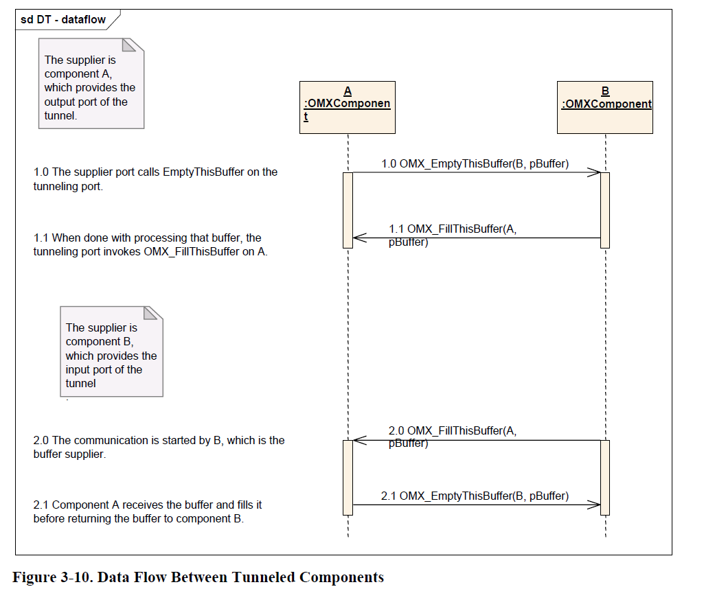

# OpenMax

## 本篇文章目标

- 了解 OpenMax 框架
- 了解 OpenMax 的调用流程
- 了解 OpenMax 数据处理流程
- 了解 OpenMax component

## OpenMax 简介

OpenMax, 简称 OMX, 是一个多媒体应用程序的标准，是跨平台的 C 语言程序接口序列  
这些接口对音频、视频以及静态图片的常用操作进行封装

OpenMax 总共包括三层，分别是应用层(AI)、集成层(IL)和开发层(DL)。  
  - **应用层**规定了应用程序和多媒体中间层的标准接口，使应用程序的移植性更好。
  - **集成层**定义了多媒体组件的接口，使得多媒体框架能以一种统一的方式访问多媒体 Codec 和组件，以便在嵌入式流媒体框架中快速集成加速编解码器。
  - **开发层**为 Codec 厂商和硬件厂商提供了一套 API，使开发更加便捷

在 Android 中，OpenMax 的 IL 层通常可以用于多媒体引擎的插件  
Android 的多媒体引擎 StageFright 可以使用 OpenMax 作为插件，主要用于编解码（Codec）的处理。

### 集成层(IL)

OpenMax 集成层由 Client、Core、Component 和 Port 组成。

- Client
  Client 通过 Core 得到对应 Component 的 Handle，而后通过命令直接和 Component 进行交互。

- component
  每个 Component 至少有一个 Port 进行数据交互  
  如 Decoder 有一个输入 Port 接收码流，一个输出 Port 输出 YUV 序列。  
  Component 内部可能通过消息处理机制完成 Client 要求的任务。

> 关键点：应用层、集成层、开发层、component

## OpenMax 在 Android 中的位置

## OpenMax 框架

### 整体框架

### IL 层框架

### Component 框架

### Component States

## OpenMax IL 头文件描述

OpenMax 标准只有头文件，没有标准的库。对于实现者，需要实现的主要是包含函数指针的结构体。  
头文件路径：frameworks/native/headers/media_plugin/media/openmax/

**OpenMax 标准头文件的介绍如下：**  
OpenMax_Types.h：OpenMax IL 的数据类型定义  
OpenMax_Core.h：OpenMax IL 核心的 API  
OpenMax_Component.h：OpenMax IL 组件相关的 API  
OpenMax_Audio.h：音频相关的常量和数据结构  
OpenMax_IVCommon.h：图像和视频公共的常量和数据结构  
OpenMax_Image.h：图像相关的常量和数据结构  
OpenMax_Video.h：视频相关的常量和数据结构  
OpenMax_Other.h：其他数据结构（包括 A/V 同步）  
OpenMax_Index.h：OpenMax IL 定义的数据结构索引  
OpenMax_ContentPipe.h：内容的管道定义

其中，OpenMax_Component.h 中定义的 OpenMax_COMPONENTTYPE 结构体是 OpenMax IL 层的核心内容。

## OpenMax IL 层调用流程

OpenMax IL 层接口的调用流程如下：

**1. OpenMax core 初始化**  
OpenMax_Init：OpenMax 组件初始化，能力及端口查询，利用 OpenMax_GetHandle 调用来实例化想要的 OpenMax 组件，同时注册回调，利用 OpenMax_GetParameter 调用来获取 OpenMax 组件的能力和 OpenMax 组件上可用端口的数量

**2. OpenMax 组件输入输出参数、及 buffer 设置**  
OpenMax_GetParameter
OpenMax_SetParameter
OpenMax_UseBuffer / OpenMax_AllocateBuffer

**3. OpenMax 状态转换（loaded -&gt; idle -&gt; executing）**  
OpenMax_SendCommand

**4. 数据注入、处理后的数据获取**  
OpenMax_EmptyThisBuffer
OpenMax_FillThisBuffer
EmptyBufferDone
FillBufferDone

**5. OpenMax 状态转换（executing -&gt; idle -&gt; loaded）**  
OpenMax_SendCommand

**6. 释放 buffer 及 handle**  
OpenMax_FreeBuffer
OpenMax_FreeHandle

**7. 反初始化**  
OpenMax_Deinit

> 关键点：调用流程

## OpenMax 服务启动流程图

media.codec 服务启动的时候，会创建 OpenMaxStore 和 OpenMax

- OpenMaxStore 的初始化  
  OpenMaxStore 初始化会通过 MediaCodecsXmlParser 加载“/vendor/etc/media_codecs_ext.xml”、“/vendor/etc/media_codecs.xml”以及“/vendor/etc/media_codecs_performance.xml”文件，并保存解析到的音视频解码器描述信息。

- OpenMax 的初始化  
  OpenMax 的初始化会创建 OpenMaxMaster 以及 xml 文件解析类 MediaCodecsXmlParser。OpenMaxMaster 管理解码插件 plugin，其中包含 google 原生的 SoftOpenMaxPlugin 以及厂商的 VendorPlugin

  - **产商的 VendorPlugin：**

    1. 产商要实现自己的 OpenMax 解码插件，就必现定义一个继承了 OpenMaxPluginBase 基类的插件类，并实现基类的接口。
    2. OpenMaxMaster 首先是加载产商插件 XxxOpenMaxPlugin，在 XxxOpenMaxPlugin 插件初始化的时候，会加载插件下面的各解码组件，其中包括视频硬解码组件、视频软解码组件以及音频软解码组件（包括 DTS 解码组件、AC3 解码组件和 ffmpeg 解码组件）。

  - **Google 原生的 SoftOpenMaxPlugin：**
    1. OpenMaxMaster 会去加载 google 原生的插件 SoftOpenMaxPlugin，在原生插件被加载的同时，插件内部也会加载 google 原生的各软解码组件。

OpenMaxMaster 加载完所有的插件和组件之后，会保存所有已成功加载的 plugin，以及各 component 和所属 plugin 的对应关系。

至此，整个 OpenMax 服务启动完成。

> 关键点：启动流程

## OpenMax non-tunneled 数据 flow

## OpenMax tunneled 数据 flow

## OpenMax component 的工作方式

**1. client 与 component 的通信**

OpenMAX IL client 与 component 的通信有两种类型：  
一种是发送控制命令；另一种是发送数据处理消息。

两种通信的过程如下：

- **发送控制命令**  
  OpenMAX IL client 通过调用 OpenMax_SendCommand，来触发 messageSem 信号量，通知事件处理线程。

- **发送数据处理消息**  
  OpenMAX IL client 通过调用 OpenMax* EmptyThisBuff 和 OpenMax* FillThisBuff 来触发 bMgmtSem 信号量，通知数据处理线程，完成 component 的数据处理功能。

**2. Component 线程**

为了保证数据处理过程独立，Component 会创建两个线程：

- 一个是**事件处理线程**，构造此 component 时在 Constructor 中创建，用来处理用户发给 component 事件, 比如：  
  OpenMax_CommandStateSet ：改变 component 状态  
  OpenMax_CommandFlush ：清空 component 的数据队列  
  OpenMax_CommandPortDisable ：禁止 component 的特定 port  
  OpenMax_CommandPortEnable ：打开 Component 的特定 port  
  OpenMax_CommandMarkBuffer ：申请用于数据交换的 buffer

- 另一个是**数据处理线程**，当 component 创建成功后，数据处理线程由 StateLoaded 状态转换到 StateIdle 状态时创建，用来对 component 的数据队列进行管理。
  例如，对于一个 codec component 来说，主要完成如下功能：
  1. 从 input port 的数据队列取得一个输入 buffer，如果没有取到则等待，直到成功；
  2. 从 output port 的数据队列取得一个输出 buffer，如果没有取到则等待，直到成功；
  3. 调用 BufferMgmtCallback 函数进行解码；
  4. 解码完成后，触发 input port 和 output port 的 ReturnBufferFunction 函数，然后进入等待状态，等待下一轮处理过程。

> 关键点：IL client 与 component 的两种通信方式、component 的线程

## OpenMax 相关 code 位置

frameworks/av/media/libstagefright/ACodec.cpp  
frameworks/av/media/libstagefright/include/media/stagefright/ACodec.h

frameworks/av/media/libstagefright/OpenMaxClient.cpp  
frameworks/av/media/libstagefright/include/media/stagefright/OpenMaxClient.h

frameworks/av/media/libstagefright/OpenMax/  
frameworks/av/media/libstagefright/include/media/stagefright/

frameworks/av/media/libstagefright/OpenMax/ OpenMaxMaster.cpp  
frameworks/av/media/libstagefright/OpenMax/include/media/stagefright/OpenMax/ OpenMaxMaster.h

frameworks/av/media/libstagefright/OpenMax/SoftOpenMaxPlugin.cpp  
frameworks/av/media/libstagefright/OpenMax/include/media/stagefright/OpenMax/SoftOpenMaxPlugin.h

frameworks/av/media/libstagefright/OpenMax/OpenMaxNodeInstance.cpp  
frameworks/av/media/libstagefright/OpenMax/include/media/stagefright/OpenMax/OpenMaxNodeInstance.h

frameworks/av/media/libstagefright/OpenMax/SoftOpenMaxComponent.cpp  
frameworks/av/media/libstagefright/OpenMax/include/media/stagefright/OpenMax/SoftOpenMaxComponent.h

frameworks/av/media/libstagefright/OpenMax/SimpleSoftOpenMaxComponent.cpp  
frameworks/av/media/libstagefright/OpenMax/include/media/stagefright/OpenMax/SimpleSoftOpenMaxComponent.h

frameworks/av/media/libstagefright/codecs

frameworks/av/media/libstagefright/codecs/aacdec/SoftAAC2.cpp  
frameworks/av/media/libstagefright/codecs/aacdec/SoftAAC2.h

## OpenMax AAC/MP3 decode flow

具体 flow 可参考如下资料：  
[Android 平台 aac 谷歌软解框架和流程、解码库学习](https://its401.com/article/yangxi_001/47951601)  
[OpenMax Codec 详细解析](https://www.cnblogs.com/shakin/p/4741242.html)

## 参考资料

[OpenMax官网](https://www.khronos.org/openmax/)  
[OpenMax IL 官方文档](https://www.khronos.org/files/openmax_il_spec_1_0.pdf)  
[OpenMax 服务启动](https://blog.csdn.net/VNanyesheshou/article/details/115027180)  
[Android OpenMax 介绍](https://www.pianshen.com/article/2093611237/)  
[Android MultiMedia 框架完全解析](https://its401.com/searchArticle?qc=Android%20MultiMedia%E6%A1%86%E6%9E%B6%E5%AE%8C%E5%85%A8%E8%A7%A3%E6%9E%90&page=1)  
[Android 平台 aac 谷歌软解框架和流程、解码库学习](https://its401.com/article/yangxi_001/47951601)  
[OpenMax Codec 详细解析](https://www.cnblogs.com/shakin/p/4741242.html)  
[Android 解码器 component 加载](https://www.programminghunter.com/article/7043935205/)
